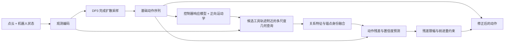

# AQR: A6_POST 原理展示源码

本仓库展示 **先生成动作，再根据动作所经过的局部几何修正动作** 的实现。代码整理自 A6_POST / H12 / A8 / anchor-preserving 实验分支，供阅读方法、审阅实现和交流思路使用。

保留完整的模型、训练损失、数据读取接口和评估调用链。**不包含权重、数据集、数据下载/转换/准备代码，也不提供历史结果的一键复现流程。**

## 轨迹视频

点击缩略图打开视频：

| 示例 804 | 示例 805 | 示例 806 |
|---|---|---|
|  |  |  |

视频由本版历史成功轨迹的真实采样渲染帧合成；帧间没有动作插值。详见 [视频来源说明](media/README.md)。

## 方法流程

每次规划先完成 DP3 的采样，再进行 **一次** AQR 修正：

`corrected_action = base_action + confidence × bounded_residual`

动作决定查询哪里，局部几何决定如何修正。当前 TCP、候选 TCP、左右指尖和扫掠轨迹的身份在聚合中被保留。局部特征为空时，修正分支严格输出零残差。

## 建议阅读顺序

| 代码 | 阅读重点 |
|---|---|
| [policy.py](contactflow/dp3/aqr_dp3/policy.py) | `predict_action` → `conditional_sample_aqr` → `_post_diffusion_refine` |
| [geometry.py](contactflow/dp3/aqr_dp3/geometry.py) | `ActionToTool`、`RelativeMultiScaleQuery`：动作到工具轨迹，再到几何关系 |
| [model.py](contactflow/dp3/aqr_dp3/model.py) | `PostDiffusionActionRefiner`、`bound_action_residual` |
| [policy.py](contactflow/dp3/aqr_dp3/policy.py) | `_compute_post_diffusion_loss`：候选生成、扰动、训练目标 |
| [features.py](contactflow/dp3/aqr_dp3/features.py) / [pointcloud.py](contactflow/dp3/aqr_dp3/pointcloud.py) | 点云编码、双点云集合及特征缓存 |
| [a6_post.yaml](configs/a6_post.yaml) | 本版独立展开的配置，无其他实验配置依赖 |

详细解释见 [方法与代码对应关系](docs/METHOD.md)。

## 代码边界

- `contactflow/dp3/aqr_dp3/`：AQR 核心模型、损失与数据读取接口。
- `contactflow/dp3/aqr_bc/`：控制器响应与可微正向运动学支持。
- `diffusion_policy_3d/`：本实现实际依赖的 DP3 代码子集。
- `contactflow/tools/`、`scripts/`：保留训练与评估入口，便于理解模型如何接入完整程序。
- `artifacts/contracts/stackcube/`：运行时控制器标定和运动学约定，不是神经网络权重。
- `tests/`：几何、残差约束、关系查询和训练组件的代码测试。

训练接口接收已有 XYZRGB 点云 Zarr 数据；在线评估还需要本地模型权重与 ManiSkill 环境元数据。仓库没有附带这些输入。依赖清单仅用于说明技术栈；阅读代码不需要安装环境。

## 版本说明

代码整理自与 `selected_epoch77.pt` 对应的 A6_POST 实现分支。原项目没有 Git 历史，因此不能确认当前源码与历史录像生成当天的源码逐字一致。

本版配置：`post_diffusion`、`query_source=final_base`、H12/A8、锚点身份保留、convex 关系融合、有界残差；关系 attention、额外 gain 和 improvement hinge loss 关闭。全局 DP3 在这版配置中参与训练。

原有兼容分支保留在核心模块内部，本文只解释 `configs/a6_post.yaml` 激活的 A6_POST 路径。
