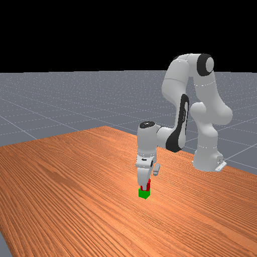
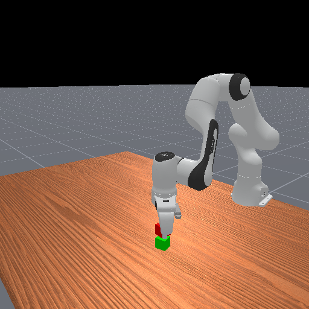
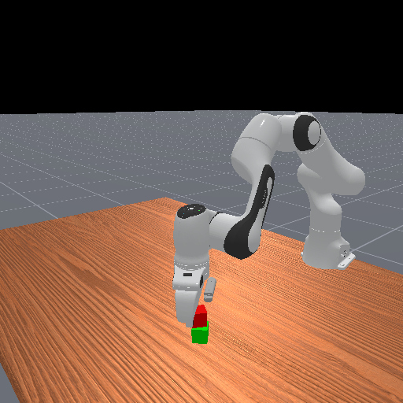
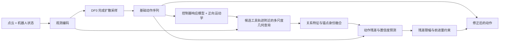

# AQR: 原理展示源码

本仓库展示 **先生成动作，再根据动作所经过的局部几何修正动作** 的实现。代码展示 A6_POST 的锚点身份保留与扩散后修正分支，供阅读方法、审阅实现和交流思路使用。

保留模型结构、训练损失和推理实现，供方法交流与代码阅读。实验配置、控制器标定、运行入口、权重、数据和内部实验记录不在公开范围内。本仓库是原理展示源码，不是可直接运行的完整实验工程。

## 轨迹视频

点击缩略图打开视频：

| 示例 1 | 示例 2 | 示例 3 |
|---|---|---|
|  |  |  |

视频由本版历史成功轨迹的真实采样渲染帧合成；帧间没有动作插值。详见 [视频来源说明](media/README.md)。

## 方法流程

每次规划先完成 DP3 的采样，再进行 **一次** AQR 修正：

`corrected_action = base_action + confidence × bounded_residual`

动作决定查询哪里，局部几何决定如何修正。当前 TCP、候选 TCP、左右指尖和扫掠轨迹的身份在聚合中被保留。局部特征为空时，修正分支严格输出零残差。

## 建议阅读顺序

| 代码 | 阅读重点 |
|---|---|
| [policy.py](contactflow/dp3/aqr_dp3/policy.py) | `predict_action` → `conditional_sample_aqr` → `_post_diffusion_refine` |
| [geometry.py](contactflow/dp3/aqr_dp3/geometry.py) | `ActionToTool`、`RelativeMultiScaleQuery`：动作到工具轨迹，再到几何关系 |
| [model.py](contactflow/dp3/aqr_dp3/model.py) | `PostDiffusionActionRefiner`、`bound_action_residual` |
| [policy.py](contactflow/dp3/aqr_dp3/policy.py) | `_compute_post_diffusion_loss`：候选生成、扰动、训练目标 |
| [features.py](contactflow/dp3/aqr_dp3/features.py) / [pointcloud.py](contactflow/dp3/aqr_dp3/pointcloud.py) | 点云编码、双点云集合及特征缓存 |

详细解释见 [方法与代码对应关系](docs/METHOD.md)。

## 公开范围

- `contactflow/dp3/aqr_dp3/`：策略、关系查询、残差修正和训练目标。
- `contactflow/dp3/aqr_bc/`：运动学支持代码；实际控制器标定未提供。
- `diffusion_policy_3d/`：本实现依赖的 DP3 源码子集。
- `media/`：三条示例轨迹视频和缩略图。

Python 模块中的 `config.py` 是模型接口、类型、默认值与校验定义，核心代码需要引用，因此保留；它不是原实验的完整配置。公开源码仍会展示算法内的默认常量和实现细节。

本版代码整理自对应实现分支，未附带历史源码版本证明。第三方 DP3 代码沿用已有来源与署名，本仓库未替第三方代码重新指定许可证。
